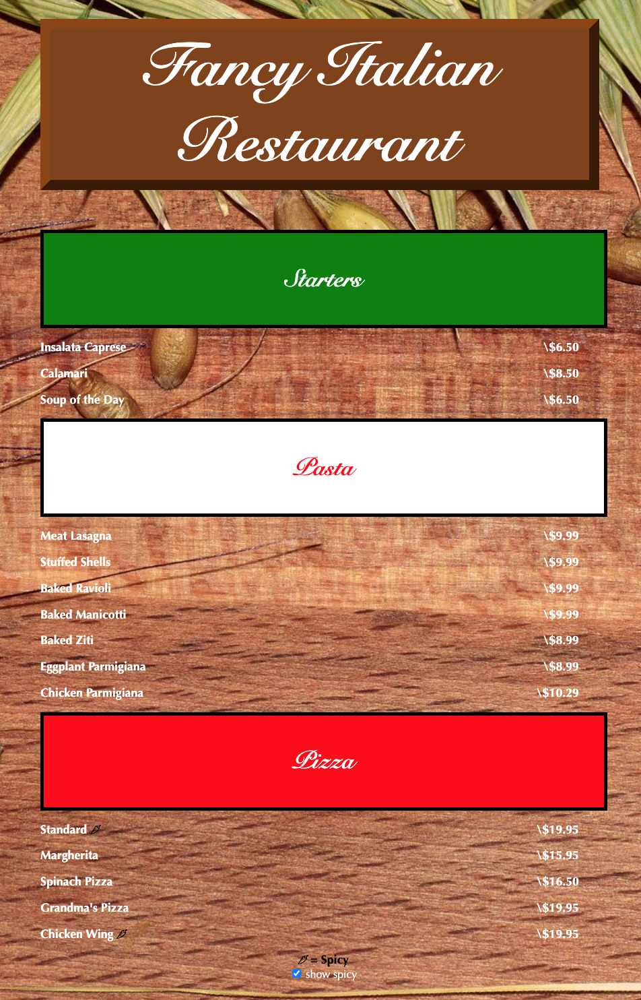

# Work / Project Examples

# Spotify SoundSource

My top showcase of my work would be an application that I was a top contibutor and team lead in within my University which utilized Spotify’s API. The idea behind the application was crowdsourcing playlists through user suggestions and upvotes in order to create popular playlists by the people for the people. Coming up with the idea and taking on the role as team lead was challenging and rewarding. Our application used React on the frontend, Springboot in the backend and was deployed using Amazon Web Services. I really enjoyed working with my team and utilising wireframes and trello in order to stay organized and tackle any problems that came up. I also enjoyed being the team lead as it allowed me to code on both the frontend and backend. In the front end I was able to configure css, html, and set up requests to the server in order to properly portray and record information. I utilized the React framework to set up functions on time intervals that utilized axios and hooks to fetch and update components on a real time basis. In the backend I was able to help set up a relational database and REST controllers so that there was seamless communication between the client and the server side. Being able to think of features and then find and learn how to implement various technologies was a great feeling. I am incredibly proud of our final product and happy our team was able to secure a perfect score on the grading of the application. 

# Personal Portfolio

Building my personal portfolio allowed me to build an application using VanillaJS and really have fun with the CSS and create something that stood out and showcased my work. I currently have screenshots of the Spotify SoundSource application and its features as well as some more information about my self. I hope to continue to add to the page and it's a great way to track my progress and to push me to continue creating applications. 

Portfolio Link:
https://benizrailov.github.io/portfolio/ 

# Inspiration

I love open source projects and the idea behind them. I find that a synergetic approach to coding and technology is many times the best way to quickly tackle a problem. Some open source projects that recently caught my eye include:

# Apache Superset:

As a big fan of Apache and their large list of open source projects, one that particularly caught my eye was Apache Superset. As a visual learner myself and choosing to focus on front end development, I love tools that provide companies with the ability to effectively visualize data. Apache Superset supplies tools that allow companies to create stunning data visualizations that provide meaning to data. I also love when technology is highly scalable and compatible with other technologies. Superset is compatible with most major databases which allows for integration into most systems. It is also has a huge number of contributors which is always an indication of a useful tech. As a frontend developer it inspires me to create something that catches the eye of its users.

source: https://superset.apache.org/

# Appsmith:

As someone who has a passion for front end programming I love seeing applications that make building applications more seamless. Seeing a tool that allows users to build frameworks visually and is easily integratible with REST API’s and databases is really interesting. Also the fact it is easily manipulated by javascript and VanillaJS is great as it lowers the learning curve for programmers when getting started. I love seeing innovation in any way possible and Appsmith is making huge strides in the little time that the technology has been available. 

source: https://www.appsmith.com/ 

# Yarn:

A widely known and used dependency management system, Yarn is something that I have personally used for much of my own personal coding. It allows for quick installs in a fast and reliable manner. It is inspiring to see an open source project that ensures consistency and is so widely used. It also inspires me to aspire to conceive a project that simplifies processes for a large number of end users. 

source: https://classic.yarnpkg.com/en/ 

# Focus 

Given the opportunity to build/learn anything I wanted, I would really want to focus on technologies and industries that are at the forefront of innovation and creativity. Being able to completely tailor something to a target audience and receive a positive response has been what drives me as a software engineer. Looking through Critical Mass’s portfolio it’s really cool to see projects like the Immersive e-Commerce site for Blizzard and Adidas Digital Product Customization which redefine and improve the user experience. Working on captivating products that are meant to enhance and transport it’s users are exactly what inspire me as a coder. It is my goal to make a project that sets out to go above and beyond in effectively carrying out a vision and communicating to an audience in a way that speaks to them. Learning the tools and technologies behind these projects and applying it to a project of my own would be a dream come true. 

# Coding Assesment 

Sandbox Link:
https://codesandbox.io/s/2022-internship-exercise-menu-forked-3eny1d?file=/src/styles.css

Menu Snap:

